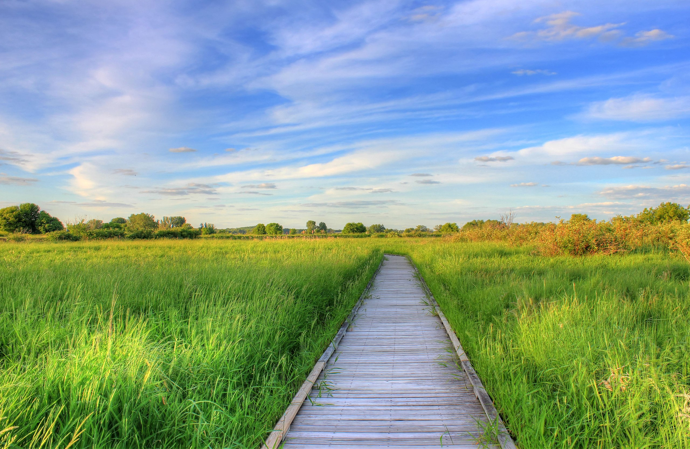

# vision

Describe image as text. Requires GPT-4.   
https://platform.openai.com/docs/guides/vision

## Run

```sh
export GPT_APIKEY=<your APIKEY>
./vision.sh
```

Result:

```json
{
  "id": "chatcmpl-A5uHIpuR3m8VmxzyradYiZuGpuc7s",
  "object": "chat.completion",
  "created": 1725971336,
  "model": "gpt-4o-2024-05-13",
  "choices": [
    {
      "index": 0,
      "message": {
        "role": "assistant",
        "content": "The image depicts a serene and expansive natural landscape featuring a wooden boardwalk or pathway that stretches into the distance. The pathway is surrounded by lush green grass and vegetation on both sides. The sky above is mostly clear with some scattered clouds, and the scene is bathed in bright sunlight, casting vivid colors and adding to the peaceful atmosphere. Trees and shrubs are visible farther away in the background, contributing to the natural and open setting.",
        "refusal": null
      },
      "logprobs": null,
      "finish_reason": "stop"
    }
  ],
  "usage": {
    "prompt_tokens": 1118,
    "completion_tokens": 86,
    "total_tokens": 1204
  },
  "system_fingerprint": "fp_992d1ea92d"
}
```

Source image:

